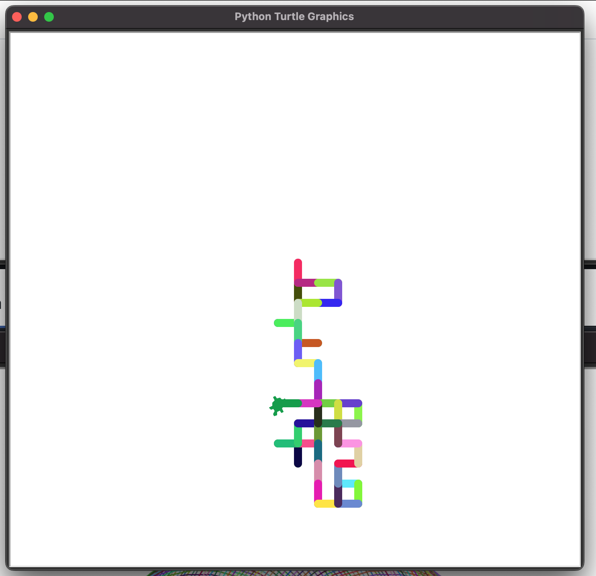

# Desafios Dia 18

### Desafio 1 - Fazendo um quadrado na GUI

### Desafio 2 - Desenhar uma linha pontilhada

### Desafio 3 - Desenhar um triangulo, quadrado, pentagono, hexagono, heptagono, octogono, eneagono e decagono sobrepostos em sequencia

### Desafio 4 - Faca percorrer um caminho aleatorio

