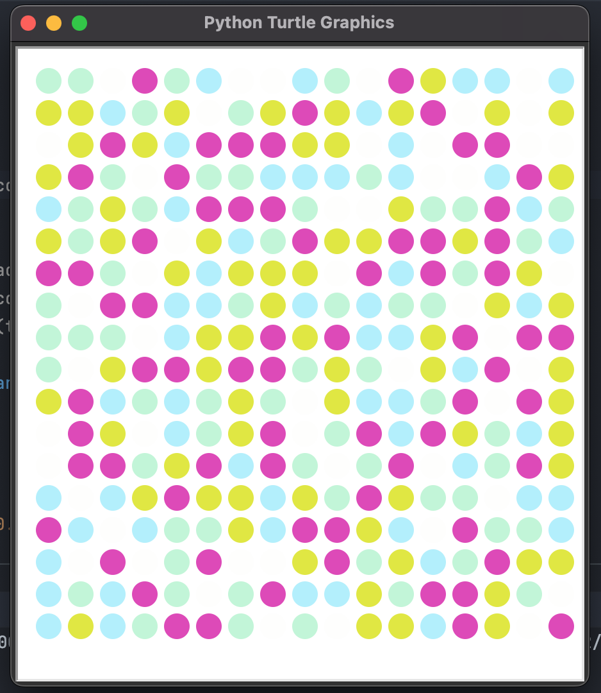

# Projeto Dia 18

 - Entendendo os gráficos da biblioteca Turtle e como usar a documentação
 - Importando módulos e instalando pacotes
 - Tuplas Python e como gerar cores RGB aleatórias com a biblioteca Colorgram

