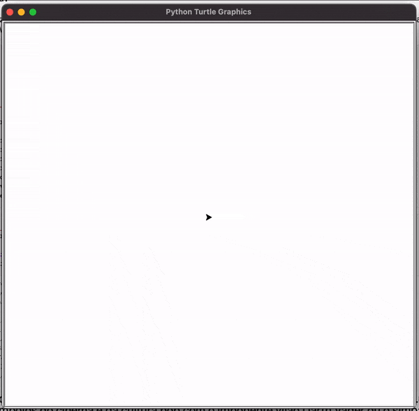
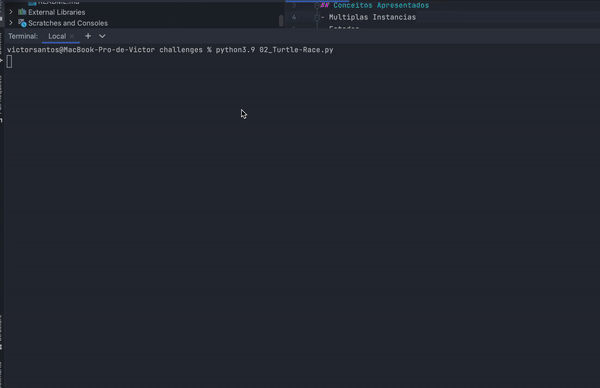

# Desafios dia 19

## Conceitos Apresentados
- Multiplas Instancias
- Estados
- Higher Order Functions (Funcoes como parametro de outras funcoes)
- Event Listeners

## 1. Etch-A-Sketch App

[Link do codigo](./01_Etch-A-Sketch%20App.py)

## 2. Turtle Race

[Link do codigo](./02_Turtle-Race.py)
