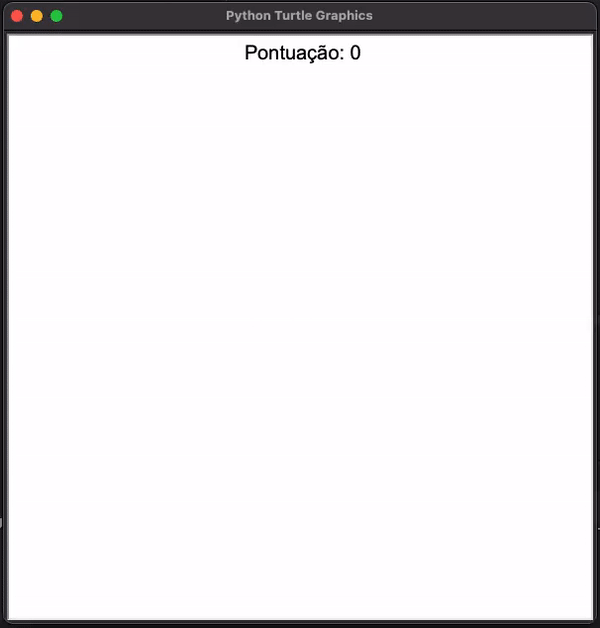

# Projeto dias 20 e 21

## Conceitos Apresentados

 - Configuração de tela e criação do corpo da cobra
 - Animando as partes da cobra na tela
 - Criacao de classes e aplicacao da orientacao a objetos
 - Controlando a cobra com o pressionamento de setas no teclado
 - Herança de classes
 - Como fatiar listas e tuplas em Python

Links do Codigo:
- [Classe Main](./main.py)
- [Classe Cobra](./cobra.py)
- [Classe Pilula](./pilula.py)
- [Classe Placar](./placar.py)
